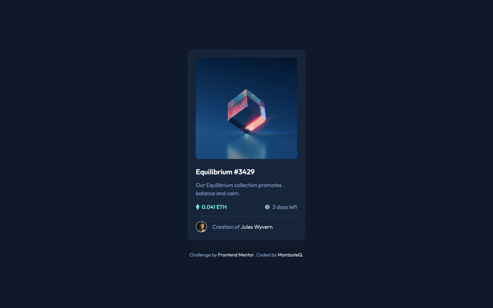
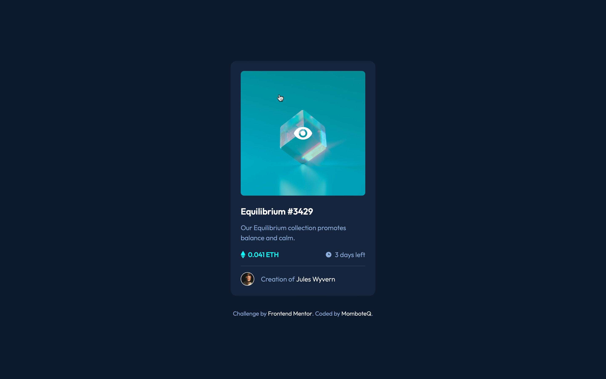
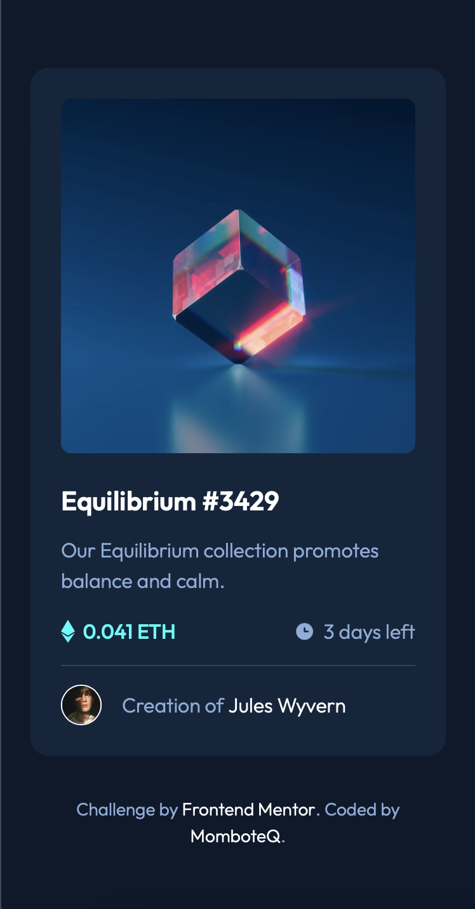

# Frontend Mentor - NFT preview card component solution

This is a solution to the [NFT preview card component challenge on Frontend Mentor](https://www.frontendmentor.io/challenges/nft-preview-card-component-SbdUL_w0U). Frontend Mentor challenges help you improve your coding skills by building realistic projects.

## Table of contents

-   [Overview](#overview)
    -   [The challenge](#the-challenge)
    -   [Screenshot](#screenshot)
    -   [Links](#links)
-   [Built with](#built-with)
-   [Author](#author)

## Overview

### The challenge

Users should be able to:

-   View the optimal layout depending on their device's screen size
-   See hover states for interactive elements

### Screenshot

### Desktop view

    
    

### Mobile view

    

### Links

-   Live Site URL: [Live Site](https://momboteq.github.io/nft-preview-card-component)

## My process

### Built with

-   Flexbox
-   Mobile-first workflow
-   [React](https://reactjs.org) - JS library
-   [Tailwind CSS](https://tailwindcss.com) - CSS Framework

## Author

-   Website - [MomboteQ.github.io](https://MomboteQ.github.io)
-   Frontend Mentor - [@MomboteQ](https://www.frontendmentor.io/profile/MomboteQ)
